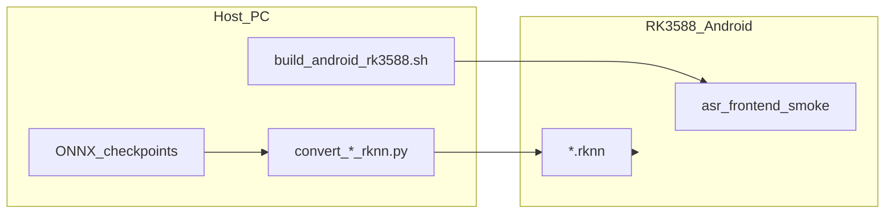

# RK3588 Android RKNN 部署指南

本文说明如何在 RK3588 Android 开发板上使用 **RKNN** 运行 `cpp/asr_frontend` 流式前端（AEC + ZipEnhancer），并与 Linux 上默认的 **ONNX Runtime** 路径对照。

## 1. 架构与后端选择

推理后端在 **编译期** 通过 CMake 选项选定，同一套 API（`AsrFrontendApi` / `StreamInference`）在两种后端下共用流式缓冲与重采样逻辑。

| 场景 | CMake | 模型文件 | 运行环境 |
|------|-------|----------|----------|
| 开发机 Linux | `-DASR_FRONTEND_INFERENCE_BACKEND=ONNX`（默认） | `*.onnx` | x64 + ONNX Runtime |
| RK3588 板子 Android（**RKNN**，生产） | `-DASR_FRONTEND_INFERENCE_BACKEND=RKNN` | `*.rknn` | arm64-v8a + `librknnrt.so` |
| RK3588 板子 Android（**ONNX**，调试） | `-DASR_FRONTEND_INFERENCE_BACKEND=ONNX` | `*.onnx` | arm64-v8a + `libonnxruntime.so`（CPU） |

编译 RKNN 后端时会定义 `ASR_FRONTEND_USE_RKNN=1`，`AsrFrontendPaths` 使用 `dfsmn_aec_rknn` / `zipenhancer_full_rknn` 字段。



## 2. 环境准备

### 2.1 主机（PC）

- **rknn-toolkit2**：用于 ONNX → RKNN 转换（版本需与板端 NPU 驱动 / `librknnrt.so` 匹配，参考 [rknn_model_zoo](https://github.com/airockchip/rknn_model_zoo) 文档）。
- **Android NDK**：推荐 r18 或 r19（与 `rknn_model_zoo/build-android.sh` 一致）。
- **rknn_model_zoo**：提供预置 `librknnrt.so` 与头文件，例如：
  - `3rdparty/rknpu2/include/rknn_api.h`
  - `3rdparty/rknpu2/Android/arm64-v8a/librknnrt.so`
- **adb**：用于推送与 shell 调试。

环境变量示例：

```bash
export ANDROID_NDK_PATH=~/other/android-ndk-r19c
export RKNN_MODEL_ZOO_ROOT=~/workspace/rknn_model_zoo
```

### 2.2 开发板

- 平台：**RK3588**，系统：**Android**，ABI 一般为 **arm64-v8a**。
- 确认架构：

```bash
adb shell getprop ro.product.cpu.abi
```

## 3. 模型准备（ONNX → RKNN）

**推荐 Python 环境**（已验证 toolkit 2.3.2）：

```bash
export RKNN_PY=/home/jingsz/.pyenv/versions/3.8.19/envs/rknn/bin/python
```

默认 ONNX 路径（相对仓库根目录，与 Python `config` 一致）：

- `asr_frontend/asr_frontend/checkpoints/dfsmn_aec_16k/DFSMN_AEC_opt.onnx`
- `asr_frontend/asr_frontend/checkpoints/zip_enhancer_se_16k/zipenhancer_full.onnx`（原始导出）
- `asr_frontend/asr_frontend/checkpoints/zip_enhancer_se_16k/zipenhancer_full_sim.onnx`（**RKNN 转换用**，见下）

### 3.0 ZipEnhancer ONNX 图简化（RKNN 转换前）

原始 `zipenhancer_full.onnx` 图较大（约 4883 个节点），`rknn.build` 阶段内存占用很高。先用 **onnxsim** 生成简化版（约 2779 节点），再转 RKNN。Linux ONNX Runtime 路径仍使用原始 `zipenhancer_full.onnx`，无需替换。

在仓库根目录、已安装 `onnxsim` 的 `${RKNN_PY}` 环境中执行（`--no-large-tensor` 与 `--skip-shape-inference` 可避免大图常量折叠与 shape 推断导致的 OOM/耗时）：

```bash
# 需先 export RKNN_PY（见本节开头）
${RKNN_PY} -m onnxsim \
  asr_frontend/asr_frontend/checkpoints/zip_enhancer_se_16k/zipenhancer_full.onnx \
  asr_frontend/asr_frontend/checkpoints/zip_enhancer_se_16k/zipenhancer_full_sim.onnx \
  --no-large-tensor --skip-shape-inference
```

### 3.1 ONNX → RKNN

`rknn.build()` 本身对大型模型极耗内存，脚本已默认启用两项关键降内存选项：

| 选项 | 默认 | 效果 |
|------|------|------|
| `--single_core_mode` | 开启 | rk3588 有 3 个 NPU 核，默认 build 生成三份映射；单核模式减少约 2/3 的 build 峰值内存（运行时实际性能几乎不变） |
| `--compress_weight` | 开启 | 压缩权重张量，进一步减少 build 与运行时内存 |
| `--optimization_level 0` | 0 | 关闭图优化，避免优化 pass 带来的额外内存 |

在已安装 `rknn-toolkit2` 的同一 Python 环境中执行：

```bash
cd cpp/asr_frontend/scripts

# DFSMN AEC：固定输入 [1, 16320] int16 双路
${RKNN_PY} convert_dfsmn_aec_rknn.py \
  --model ../../../asr_frontend/asr_frontend/checkpoints/dfsmn_aec_16k/DFSMN_AEC_opt.onnx \
  --target rk3588 \
  --dtype fp

# ZipEnhancer：固定输入 [1, 16000] float（1s @ 16kHz，与 se_decode_window_sec=1.0 一致）
# 默认已开启 --single_core_mode / --compress_weight，可在低内存机器上完成转换
${RKNN_PY} convert_zipenhancer_rknn.py \
  --model ../../../asr_frontend/asr_frontend/checkpoints/zip_enhancer_se_16k/zipenhancer_full_sim.onnx \
  --output_path ../../../asr_frontend/asr_frontend/checkpoints/zip_enhancer_se_16k/zipenhancer_full.rknn \
  --target rk3588 \
  --dtype fp
```

输出默认同目录下的 `DFSMN_AEC_opt.rknn`；ZipEnhancer 见上 `--output_path`（否则默认会生成 `zipenhancer_full_sim.rknn`）。

### 3.2 转换后验证（建议）

1. 在 PC 上 `rknn.init_runtime(target='rk3588')` 做仿真推理（若 toolkit 支持）。
2. 或用短音频 / 随机张量对比 ONNX Runtime 输出（fp 模式容差更严）。
3. **DFSMN** 若因 `ai.onnx.ml` 等算子转换失败，可尝试：简化 ONNX、降低 opset、或首版仅在 SE 侧使用 RKNN（需自行关闭 AEC 或保留 ONNX AEC）。
4. **ZipEnhancer build OOM**：按顺序尝试：
   - 确认已执行 §3.0 生成 `zipenhancer_full_sim.onnx`
   - 脚本默认已启用 `--single_core_mode`（减 2/3 build 内存）与 `--compress_weight`
   - 若仍 OOM，手动关闭其他大内存进程，再以 `--min_avail_gb 0` 跳过内存检查后重试

首版脚本默认 `--dtype fp`（不量化），以降低 int16 量化对齐成本；量化可加 `--dtype i8` 并准备校准数据。

## 4. 交叉编译（Android RKNN）

使用封装脚本（推荐）：

```bash
export ANDROID_NDK_PATH=~/other/android-ndk-r19c
export RKNN_MODEL_ZOO_ROOT=~/workspace/rknn_model_zoo

cd cpp/asr_frontend
./scripts/build_android_rk3588.sh
```

产物安装目录默认为：

`cpp/asr_frontend/install/rk3588_android_arm64-v8a/asr_frontend_smoke/`

```
asr_frontend_smoke/
  asr_frontend_smoke      # 可执行文件
  lib/librknnrt.so
  model/README_MODELS.txt
```

手动 CMake 等价命令见 [`scripts/build_android_rk3588.sh`](../scripts/build_android_rk3588.sh)（默认 `INFERENCE_BACKEND=RKNN`）。

### 4.2 Android ONNX 后端构建（CPU，调试用）

无需 `RKNN_MODEL_ZOO_ROOT`；CMake 会从 Maven Central 自动下载 `onnxruntime-android-1.17.1.aar` 并解包。

```bash
export ANDROID_NDK_PATH=~/other/android-ndk-r19c   # 未设置时脚本默认 ~/other/android-ndk-r19c
export INFERENCE_BACKEND=ONNX

cd cpp/asr_frontend
./scripts/build_android_rk3588.sh
```

脚本使用 NDK `android.toolchain.cmake`（API 28、`c++_shared`），并打包 `libonnxruntime.so` + `libc++_shared.so`。

产物 `install/.../asr_frontend_smoke/lib/` 下为 **`libonnxruntime.so`**（约 45 MB），无 `librknnrt.so`。

板端 GTest（`cpp_test_steam`）见 [`cpp/test/README.md`](../../test/README.md) 与 `cpp/test/scripts/build_android_onnx_test.sh`。

### 4.1 Linux ONNX 构建（不变）

```bash
cd cpp
cmake -B build -S .
cmake --build build -j$(nproc)
```

## 5. 部署到板子（adb）

将转换好的 `.rknn` 放入安装包的 `model/` 目录，或单独 push：

```bash
adb root
adb remount
adb push cpp/asr_frontend/install/rk3588_android_arm64-v8a/asr_frontend_smoke /data/
# 若模型未打包，再 push：
# adb push /path/to/DFSMN_AEC_opt.rknn /data/asr_frontend_smoke/model/
# adb push /path/to/zipenhancer_full.rknn /data/asr_frontend_smoke/model/
```

## 6. 运行与调试

```bash
adb shell
cd /data/asr_frontend_smoke
export LD_LIBRARY_PATH=./lib

./asr_frontend_smoke \
  model/DFSMN_AEC_opt.rknn \
  model/zipenhancer_full.rknn
```

成功时会打印 `backend: RKNN` 与 `smoke outputs: N`。

**ONNX 后端**（需先 §4.2 构建并 push `.onnx` 模型）：

```bash
./asr_frontend_smoke \
  model/DFSMN_AEC_opt.onnx \
  model/zipenhancer_full.onnx
```

成功时会打印 `backend: ONNX` 与 `smoke outputs: N`。

板端 GTest（`cpp_test_steam`）通过环境变量指定模型路径，例如：

```bash
DFSMN_AEC_ONNX_PATH=/data/android_onnx_test/model/DFSMN_AEC_opt.onnx \
ZIPENHANCER_FULL_ONNX_PATH=/data/android_onnx_test/model/zipenhancer_full.onnx \
./cpp_test_steam --gtest_filter="*"
```

详见 [`cpp/test/README.md`](../../test/README.md)。

### 6.1 常见问题

| 现象 | 处理 |
|------|------|
| `error while loading shared libraries: librknnrt.so` | 确认 `export LD_LIBRARY_PATH=./lib` |
| `rknn_init fail` | 模型与驱动/toolkit 版本不匹配；重新转换或更新板端 NPU 固件 |
| `tensor shape mismatch` | ZipEnhancer RKNN 输入时间维须为 **16000**（与 `--decode_window_sec` 一致） |
| DFSMN 转换失败 | 见 §3.2；检查 ONNX 是否含 RKNN 不支持算子 |
| ZipEnhancer build 内存不足 | 先跑 §3.0 onnxsim；默认已开启 `--single_core_mode --compress_weight`；详见 §3.2 第4条 |

日志：

```bash
adb logcat | grep -i rknn
```

## 7. 与 Linux ONNX 流程对照

| 步骤 | Linux ONNX | RK3588 Android RKNN | RK3588 Android ONNX |
|------|------------|---------------------|----------------------|
| 依赖 | ONNX Runtime | rknn_model_zoo `librknnrt.so` | `libonnxruntime.so`（AAR 自动下载） |
| CMake | 默认 `ONNX` | `INFERENCE_BACKEND=RKNN` | `INFERENCE_BACKEND=ONNX` |
| 模型 | `.onnx` | `.rknn`（脚本转换） | `.onnx`（与 Linux 相同） |
| 运行 | 主机直接跑 `asr_frontend_smoke` | `adb push` + `LD_LIBRARY_PATH` | 同上 |
| 路径字段 | `dfsmn_aec_onnx`, `zipenhancer_full_onnx` | `dfsmn_aec_rknn`, `zipenhancer_full_rknn` | `dfsmn_aec_onnx`, `zipenhancer_full_onnx` |

## 8. 参考

- 本仓库 C++ API：[`include/asr_frontend/asr_frontend_api.hpp`](../include/asr_frontend/asr_frontend_api.hpp)
- Rockchip 示例：[`rknn_model_zoo/examples/mobilenet`](https://github.com/airockchip/rknn_model_zoo/tree/main/examples/mobilenet)（`build-android.sh`、`mobilenet.py`、`rknpu2/mobilenet.cc`）
