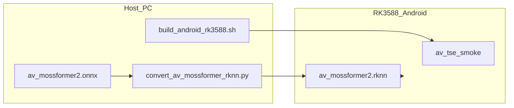

# RK3588 Android RKNN 部署指南（av_tse）

本文说明如何在 **RK3588 Android** 开发板上用 **RKNN** 运行 `cpp/av_tse` 的 AV-Mossformer 分离模型，并与 Linux 默认 **ONNX Runtime** 路径对照。流程参考 [`cpp/asr_frontend/docs/RK3588_ANDROID_RKNN.md`](../../asr_frontend/docs/RK3588_ANDROID_RKNN.md) 与 [rknn_model_zoo mobilenet](https://github.com/airockchip/rknn_model_zoo/tree/main/examples/mobilenet)。

## 1. 架构与后端选择

| 场景 | CMake | 模型 | 运行环境 |
|------|-------|------|----------|
| 开发机 Linux | `-DAV_TSE_INFERENCE_BACKEND=ONNX`（默认） | `av_mossformer2.onnx` | x64 + ONNX Runtime |
| RK3588 Android 板测（**RKNN**） | `-DAV_TSE_INFERENCE_BACKEND=RKNN` | `av_mossformer2.rknn` | arm64-v8a + `librknnrt.so` |
| RK3588 Android（**ONNX**，调试） | `-DAV_TSE_INFERENCE_BACKEND=ONNX` | `av_mossformer2.onnx` | arm64-v8a + `libonnxruntime.so`（CPU） |

RKNN 编译会定义 `AV_TSE_USE_RKNN=1`，`StreamInferenceSDK` / `AVStreamInference` 使用 `rknn_path` 字段加载模型；推理在运行时对 **固定 shape** 做 pad/trim（与转换脚本一致）。



**说明：** Android 默认只交叉编译 **`av_tse_smoke`**（单模型随机输入推理），用于验证 RKNN 与 NPU。完整流式 SDK（Haar 人脸 + 视频重采样）依赖 `opencv_objdetect`；rknn_model_zoo 自带的 Android OpenCV 位于 `3rdparty/opencv/opencv-android-sdk-build/`，**未包含** `opencv_objdetect`。要在板端编 **完整 `libav_tse`**，请先按 [§2.3](#23-自行交叉编译-opencv-android-含-objdetect) 交叉编译 OpenCV，并设置 **`-DAV_TSE_ANDROID_OPENCV_DIR=.../sdk/native/jni/abi-arm64-v8a`**；或使用 Linux + RKNN 跑全功能。

## 2. 环境准备

### 2.1 主机（PC）

| 组件 | 路径 / 版本 |
|------|-------------|
| **rknn-toolkit2** | Python 3.8 虚拟环境（与板端 `librknnrt.so` 版本匹配） |
| **推荐 Python** | `/home/jingsz/.pyenv/versions/3.8.19/envs/rknn/bin/python` |
| **Android NDK** | r18 / r19（与 model_zoo 一致） |
| **NDK 示例路径** | `~/other/android-ndk-r19c` |
| **rknn_model_zoo** | `~/workspace/rknn_model_zoo`（含 `3rdparty/rknpu2` 与可选自带 OpenCV） |
| **RKNPU2 Runtime（可选）** | 若未克隆完整 zoo，可设 **`RKNN_RKNPU2_ROOT`** 为以下之一：<br>• Rockchip **rknpu2** 包根目录（与 zoo 相同布局：`include/` + `Android/arm64-v8a/`）<br>• **`rknn-toolkit2/rknpu2`**（脚本与 CMake 同时识别 `runtime/Android/librknn_api/...` 布局） |
| **adb** | 推送与 shell 调试 |

```bash
export ANDROID_NDK_PATH=~/other/android-ndk-r19c
export RKNN_MODEL_ZOO_ROOT=~/workspace/rknn_model_zoo   # 或仅用 SDK：export RKNN_RKNPU2_ROOT=~/rknpu2
export RKNN_PY=/home/jingsz/.pyenv/versions/3.8.19/envs/rknn/bin/python
```

### 2.2 开发板

- 平台：**RK3588**，系统：**Android**，ABI 一般为 **arm64-v8a**

```bash
adb shell getprop ro.product.cpu.abi
# 期望: arm64-v8a
```

### 2.3 自行交叉编译 OpenCV Android（含 objdetect）

rknn_model_zoo 自带的 Android OpenCV 路径示例：

`$RKNN_MODEL_ZOO_ROOT/3rdparty/opencv/opencv-android-sdk-build/sdk/native/jni/abi-arm64-v8a/`

其中 `OpenCVModules.cmake` 只导出 `opencv_core`、`opencv_imgproc`、`opencv_features2d`、`opencv_imgcodecs`、`opencv_calib3d` 等，**没有** `opencv_objdetect`。

本仓库脚本从 **OpenCV 4.8.0 源码** 用 **NDK r19** 编出带 `objdetect` 的静态库（关闭 **`videoio`** 与 **`WITH_ADE`**，避免安装图里引用缺失的第三方库）。安装布局与官方 Android SDK 一致，便于 `find_package(OpenCV)`：

```bash
export ANDROID_NDK_PATH=~/other/android-ndk-r19c
cd cpp/av_tse
./scripts/build_opencv_android.sh
```

默认安装到：

`cpp/av_tse/third_party/opencv-4.8.0-android-arm64-v8a/sdk/native/jni/abi-arm64-v8a/`

CMake 请传（**`OpenCV_DIR` 与 `AV_TSE_ANDROID_OPENCV_DIR` 指向同一 abi 目录即可**）：

```bash
-DAV_TSE_ANDROID_OPENCV_DIR=/绝对路径/.../sdk/native/jni/abi-arm64-v8a
```

**要点：**

- OpenCV 在 `ANDROID` 下默认会开 **`BUILD_JAVA=ON`**，会强依赖 Android SDK；脚本已加 **`-DBUILD_JAVA=OFF`**，一般只需 **NDK**，无需安装 Android Studio SDK。
- `WITH_FFMPEG=OFF`：不在主机交叉编 FFmpeg；`videoio` 在板子上可走系统/Media 后端（具体能力随 API 与设备而定）。
- Haar 级联 XML 不在安装包必含路径里；可把 OpenCV 源码树中的  
  `opencv/data/haarcascades/haarcascade_frontalface_default.xml`  
  拷到应用可读目录，或在集成 `libav_tse` 时用 `-DAV_TSE_HAAR_CASCADE_PATH=...`（若你扩展了 CMake）指向该文件。

**一键编 `libav_tse` + smoke（需已编好 OpenCV）：**

```bash
export AV_TSE_ANDROID_OPENCV_DIR=/path/to/opencv-4.8.0-android-arm64-v8a/sdk/native/jni/abi-arm64-v8a
export AV_TSE_BUILD_FULL=1
./scripts/build_android_rk3588.sh
```

## 3. 模型转换（ONNX → RKNN）

默认 ONNX（相对仓库根目录）：

`av_tse/checkpoints/AV_Mossformer/av_mossformer2.onnx`

默认固定输入（与 `infer_chunk_ms=500`、`context_ms=100`、`audio_sr=16000`、`ref_sr=30`、`image_size=96` 对齐）：

| 输入名 | Shape |
|--------|-------|
| `mixture` | `[1, 9600]` |
| `ref` | `[1, 20, 96, 96, 3]` |

在已安装 **rknn-toolkit2** 的环境中执行：

```bash
cd cpp/av_tse/scripts

"${RKNN_PY}" convert_av_mossformer_rknn.py \
  --model ../../../av_tse/checkpoints/AV_Mossformer/av_mossformer2.onnx \
  --target rk3588 \
  --dtype fp
```

输出默认同目录旁的 `av_mossformer2.rknn`，可用 `--output_path` 指定。

若修改流式 hop / context，需同步指定并重新转换：

```bash
"${RKNN_PY}" convert_av_mossformer_rknn.py \
  --model /path/to/av_mossformer2.onnx \
  --infer_chunk_ms 500 \
  --context_ms 100 \
  --audio_len 9600 \
  --ref_frames 20 \
  --image_size 96 \
  --target rk3588
```

转换前会检查 `/proc/meminfo` 可用内存（默认 ≥36GiB，可用 `--min_avail_gb` 调整）。

**拆分部署（推荐）**：`ref_encoder` 走 ORT，`separator` 走 RKNN。先导出再转换：

```bash
# 仓库根目录
python export_onnx.py --export_rknn_split \
  --infer_chunk_ms 500 --context_ms 100 --audio_sr 16000 --ref_sr 30

python convert_av_mossformer_rknn.py \
  --model checkpoints/AV_Mossformer/av_mossformer_sep_rknn.onnx \
  --infer_chunk_ms 500 --audio_len 9600 --ref_frames 18 --dtype fp
```

若转换日志出现 `REGTASK: The bit width of field value exceeds the limit`（多为定长图中 `ScaledSinuEmbedding` 的 broadcast `Mul` 被展平超过 8191），请使用**含 `pin_length` 的当前 `export_onnx.py` 重新导出** `av_mossformer_sep_rknn.onnx` 后再转 RKNN。可用 `python scripts/diagnose_sep_onnx_rknn.py checkpoints/AV_Mossformer/av_mossformer_sep_rknn.onnx` 检查是否仍有大尺寸 `Mul`。`Unknown op target: 0` 在 `rknn building done` 时通常可忽略。

### 3.1 转换后验证

1. PC 上 `rknn.init_runtime(target='rk3588')` 仿真（若 toolkit 支持）。
2. 将 `.rknn` 拷到安装包 `model/` 后跑 `av_tse_smoke`（见下文）。

## 4. 交叉编译（Android RKNN smoke）

```bash
export ANDROID_NDK_PATH=~/other/android-ndk-r19c
export RKNN_MODEL_ZOO_ROOT=~/workspace/rknn_model_zoo
# 若仅有 Rockchip rknpu2 SDK（无完整 zoo）： export RKNN_RKNPU2_ROOT=~/rknpu2

cd cpp/av_tse
./scripts/build_android_rk3588.sh
```

产物目录（默认）：

`cpp/av_tse/install/rk3588_android_arm64-v8a/av_tse_smoke/`

```text
av_tse_smoke/
  av_tse_smoke          # 可执行文件
  lib/librknnrt.so
  model/README_MODELS.txt
```

手动 CMake 等价于 [`scripts/build_android_rk3588.sh`](../scripts/build_android_rk3588.sh)（默认 `INFERENCE_BACKEND=RKNN`）。

### 4.3 Android ONNX 后端（CPU，调试用）

`av_tse_smoke` 仅实现 RKNN 路径；板端 ONNX 验证请用 **`cpp_test_av_tse`**（见 [`cpp/test/README.md`](../../test/README.md)）。

```bash
export ANDROID_NDK_PATH=~/other/android-ndk-r19c
export INFERENCE_BACKEND=ONNX
# 编 libav_tse + GTest 需 OpenCV objdetect：
export AV_TSE_ANDROID_OPENCV_DIR=cpp/av_tse/third_party/opencv-4.8.0-android-arm64-v8a/sdk/native/jni/abi-arm64-v8a

cd cpp/test
./scripts/build_android_onnx_test.sh
```

### 4.0 Case B 全链路（wav + 预抽帧视频 + StreamInferenceSDK）

在 x86 主机交叉编译 **`av_tse_caseb`**（非 GTest），打包后 push 到板子固定目录 **`/data/av_tse_caseb`**：

**前置：** 已运行 [`build_opencv_android.sh`](../scripts/build_opencv_android.sh)；主机 `av_tse/` 下有 `测试用例/`（含 `test03.mp4`，仅用于打包时抽帧）、`checkpoints/AV_Mossformer/av_mossformer2.rknn`；主机已安装 **ffmpeg**（或设置 `FFMPEG_PATH`）。

```bash
export ANDROID_NDK_PATH=~/other/android-ndk-r19c
export RKNN_MODEL_ZOO_ROOT=~/workspace/rknn_model_zoo
export AV_TSE_ANDROID_OPENCV_DIR=cpp/av_tse/third_party/opencv-4.8.0-android-arm64-v8a/sdk/native/jni/abi-arm64-v8a
# 可选: export AV_TSE_ASSETS_SOURCE=/path/to/av_tse

cd cpp/av_tse
./scripts/build_android_caseb.sh
```

安装包（默认）：`install/rk3588_android_arm64-v8a/av_tse_caseb/`

```text
av_tse_caseb/           # 推送到设备后作为 /data/av_tse_caseb
  av_tse_caseb          # 可执行文件
  lib/librknnrt.so
  audio/test03.wav
  video/test03_frames/  # frame_000001.jpg ...（打包时由主机 ffmpeg 从 mp4 生成）
  model/config.yaml
  model/av_mossformer2.rknn
  out/                  # 输出 test03_out.wav
```

#### 视频帧读取（板端）

| 阶段 | 行为 |
|------|------|
| **打包（主机）** | `build_android_caseb.sh` 用 ffmpeg 将 `测试用例/视频/test03.mp4` 解为 `video/test03_frames/frame_%06d.jpg`；无 ffmpeg 或抽帧失败则脚本退出。 |
| **运行（板端）** | 仅从 `video/test03_frames/` 用 OpenCV **`cv::imread`** 读 BGR 帧；**不**读 mp4、**不**调用板端 ffmpeg、**不**使用 `VideoCapture`。 |
| **帧率** | 默认 30；可用 `export AV_TSE_CASEB_FPS=30` 覆盖（与抽帧源视频一致即可）。 |

成功时 log 应包含：`Loading pre-extracted frames from .../video/test03_frames`。

部署与运行：

```bash
adb root && adb remount
adb push cpp/av_tse/install/rk3588_android_arm64-v8a/av_tse_caseb /data/

adb shell "cd /data/av_tse_caseb && export LD_LIBRARY_PATH=./lib && ./av_tse_caseb"
# 或显式数据根: ./av_tse_caseb /data/av_tse_caseb
```

可选环境变量：`AV_TSE_CASEB_DATA_ROOT`、`AV_TSE_CASEB_FPS=30`、`AV_TSE_CASEB_MODEL_PATH`。

### 4.1 Linux ONNX 构建（不变）

```bash
cd cpp
cmake -B build -S . -DAV_TSE_INFERENCE_BACKEND=ONNX
cmake --build build -j$(nproc)
```

### 4.2 Linux RKNN 库（可选）

在 **aarch64 Linux** 或带 RKNN 运行时的环境：

```bash
cd cpp/av_tse
cmake -B build-rknn -S . \
  -DAV_TSE_INFERENCE_BACKEND=RKNN \
  -DRKNN_MODEL_ZOO_ROOT=~/workspace/rknn_model_zoo
cmake --build build-rknn -j$(nproc)
```

应用侧设置 `StreamInferenceSDKOptions::rknn_path` 而非 `onnx_path`。

## 5. 部署到板子（adb）

```bash
# 将转换好的模型放入安装目录
cp /path/to/av_mossformer2.rknn \
  cpp/av_tse/install/rk3588_android_arm64-v8a/av_tse_smoke/model/

adb root
adb remount
adb push cpp/av_tse/install/rk3588_android_arm64-v8a/av_tse_smoke /data/
```

## 6. 运行与调试

```bash
adb shell
cd /data/av_tse_smoke
export LD_LIBRARY_PATH=./lib

./av_tse_smoke model/av_mossformer2.rknn
```

成功示例输出：

```text
backend: RKNN (av_tse)
smoke ok: mixture_len=9600 ref_frames=20 out_len=9600
```

**ONNX 板测**（`cpp_test_av_tse`，见 [`cpp/test/README.md`](../../test/README.md)）：

```bash
export LD_LIBRARY_PATH=./lib
AV_TSE_CASEB_DATA_ROOT=/data/av_tse_caseb \
AV_TSE_CASEB_LAYOUT=android \
AV_TSE_TEST_MODEL_PATH=/data/android_onnx_test/model/av_mossformer2.onnx \
./cpp_test_av_tse --gtest_filter="*"
```

### 6.1 一键 adb（主机侧）

```bash
adb shell "cd /data/av_tse_smoke && export LD_LIBRARY_PATH=./lib && ./av_tse_smoke model/av_mossformer2.rknn"
```

### 6.2 常见问题

| 现象 | 处理 |
|------|------|
| `error while loading shared libraries: librknnrt.so` | `export LD_LIBRARY_PATH=./lib` |
| `rknn_init fail` | 模型与板端 NPU 驱动 / toolkit 版本不一致；重新转换或升级固件 |
| `tensor shape mismatch` | 转换时的 `audio_len`/`ref_frames` 与 C++ 模型不一致；重转或改 hop/context 参数 |
| `load_onnx failed`（转换阶段） | ONNX 含 RKNN 不支持算子；尝试简化图、降低 opset、或 `--optimization_level 0` |
| 需要完整 A/V 分离 SDK | Linux + RKNN 库，或 Android 自备带 `objdetect` 的 OpenCV 并 `-DAV_TSE_BUILD_LIBRARY=ON` |

日志：

```bash
adb logcat | grep -i rknn
```

## 7. C++ 使用 RKNN 模型（Linux 全功能 SDK）

```cpp
#include "av_tse/stream_inference_sdk.hpp"

av_tse::StreamInferenceSDKOptions opt;
opt.config_yaml = "av_tse/checkpoints/AV_Mossformer/config.yaml";
opt.rknn_path   = "av_tse/checkpoints/AV_Mossformer/av_mossformer2.rknn";
opt.infer_chunk_ms = 500.f;
opt.context_ms     = 100.f;
opt.max_history_ms = 600.f;

av_tse::StreamInferenceSDK sdk(opt);
// processAvStream(...) 与 ONNX 相同
```

编译时需 `-DAV_TSE_INFERENCE_BACKEND=RKNN` 且链接 `librknnrt.so`。

## 7.1 与 Linux ONNX / Android RKNN / Android ONNX 对照

| 步骤 | Linux ONNX | RK3588 Android RKNN | RK3588 Android ONNX |
|------|------------|---------------------|----------------------|
| 依赖 | ONNX Runtime | `librknnrt.so` | `libonnxruntime.so` |
| CMake | 默认 `ONNX` | `INFERENCE_BACKEND=RKNN` | `INFERENCE_BACKEND=ONNX` + OpenCV objdetect（GTest） |
| 模型 | `av_mossformer2.onnx` | `av_mossformer2.rknn` | `av_mossformer2.onnx` |
| 板测入口 | `cpp_test_av_tse` | `av_tse_smoke` / `av_tse_caseb` | `cpp/test/scripts/build_android_onnx_test.sh` → `cpp_test_av_tse` |
| SDK 字段 | `onnx_path` | `rknn_path` | `onnx_path` |

## 8. 与 rknn_model_zoo mobilenet 对照

| 步骤 | mobilenet 示例 | av_tse |
|------|----------------|--------|
| 转换 | `examples/mobilenet/python/mobilenet.py` | `scripts/convert_av_mossformer_rknn.py` |
| Android 编译 | `./build-android.sh -t rk3588 -a arm64-v8a -d mobilenet` | `./scripts/build_android_rk3588.sh` |
| 安装目录 | `install/rk3588_android_arm64-v8a/rknn_mobilenet_demo` | `install/.../av_tse_smoke` |
| 运行 | `./rknn_mobilenet_demo model/xxx.rknn model/bell.jpg` | `./av_tse_smoke model/av_mossformer2.rknn` |

mobilenet C++ 推理参考：[`rknn_model_zoo/examples/mobilenet/cpp/rknpu2/mobilenet.cc`](file:///home/jingsz/workspace/rknn_model_zoo/examples/mobilenet/cpp/rknpu2/mobilenet.cc)（`rknn_init` / `rknn_inputs_set` / `rknn_run`）；本仓库封装在 [`asr_frontend/src/rknn_session.cpp`](../../asr_frontend/src/rknn_session.cpp) 与 [`av_tse/src/av_mossformer_rknn.cpp`](../src/av_mossformer_rknn.cpp)。

## 9. 参考

- C++ RKNN 封装：[`include/av_tse/av_mossformer_rknn.hpp`](../include/av_tse/av_mossformer_rknn.hpp)
- 同级模块：[`cpp/asr_frontend/docs/RK3588_ANDROID_RKNN.md`](../../asr_frontend/docs/RK3588_ANDROID_RKNN.md)
- 模块 README：[`README.md`](../README.md)
